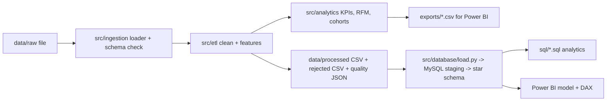

# Architecture (as implemented)

```mermaid
flowchart LR
  A[data/raw file] --> B[src/ingestion loader + schema check]
  B --> C[src/etl clean + features]
  C --> D[data/processed CSV + rejected CSV + quality JSON]
  C --> E[src/analytics KPIs, RFM, cohorts]
  E --> F[exports/*.csv for Power BI]
  D --> G[src/database/load.py -> MySQL staging -> star schema]
  G --> H[sql/*.sql analytics]
  G --> I[Power BI model + DAX]
```
Verified here: A→F (Python path, on synthetic test fixture only). Not verified: G, H, I.
